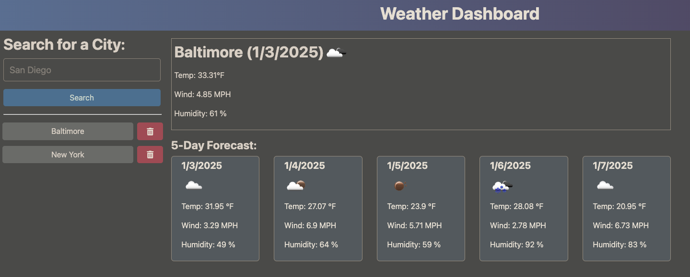

# Weather Forecast App



This is a weather forecast application that uses the OpenWeatherMap API to fetch current weather and 5-day forecast data for a specified city. The app allows users to search for cities, view current weather conditions, and see a 5-day weather forecast.

## APIs Used

This app uses the following APIs from [OpenWeatherMap](https://openweathermap.org/api):

- **Current Weather Data API**: Fetches current weather data for a city.
- **5-Day Forecast Data API**: Retrieves 5-day weather forecast data at 3-hour intervals.

## Features

- View current weather conditions (temperature, humidity, wind speed, etc.).
- View a 5-day weather forecast for any given city.
- Search history feature to track past cities searched.
- Fetch data from OpenWeatherMap API for accurate and up-to-date weather information.

## Prerequisites

Before you run the app locally, make sure you have the following installed:

- [Node.js](https://nodejs.org/)
- [npm](https://www.npmjs.com/) (Node Package Manager)

You will also need an OpenWeatherMap API key, which can be obtained by signing up at [OpenWeatherMap](https://openweathermap.org/).

## Clone the Repository

To clone this repository and run the app locally, follow these steps:

1. Open your terminal or command prompt.
2. Navigate to the directory where you want to clone the repository.
3. Run the following command to clone the repo:

   ```bash
   git clone https://github.com/your-username/weather-forecast-app.git
4. Navigate into the cloned project folder:
- cd weather-forecast-app
5. Run the following command to install the required dependencies:
- npm i
6. Create a .env file in the root directory of the project.
7. Add your OpenWeatherMap API key in the .env file:
- OPENWEATHER_API_KEY=your-api-key-here

## Run the App Locally

To start the application, run:
- npm start

## Testing with Thunder Client (Visual Studio Code)

You can use Thunder Client in Visual Studio Code to test the OpenWeatherMap API calls. Follow these steps:

1. Install Thunder Client Extension:
- Open Visual Studio Code.
- Go to the Extensions tab (or press Cmd+Shift+X on macOS or Ctrl+Shift+X on Windows/Linux).
- Search for Thunder Client and click Install.

2. Set Up Thunder Client:
- Once installed, you’ll see a Thunder Client icon in the sidebar.
- Click on the icon to open the Thunder Client interface.

3. Create a New Request:
- Click the New Request button (the plus sign in the top left corner).
- A new tab will open where you can enter the details of your API request.

4. Make API Requests:
- For Current Weather:
Method: GET
URL: https://api.openweathermap.org/data/2.5/weather?q={cityName}&appid={yourAPIKey}
Replace {cityName} with the name of the city you want to check the weather for (e.g., London) and {yourAPIKey} with your OpenWeatherMap API key.
- For 5-Day Forecast:
Method: GET
URL: https://api.openweathermap.org/data/2.5/forecast?q={cityName}&appid={yourAPIKey}
Again, replace {cityName} with a city name and {yourAPIKey} with your OpenWeatherMap API key.

5. Send the Request:
- Click the Send button to execute the request.
- Thunder Client will display the response in a panel below, showing the weather data in JSON format.
